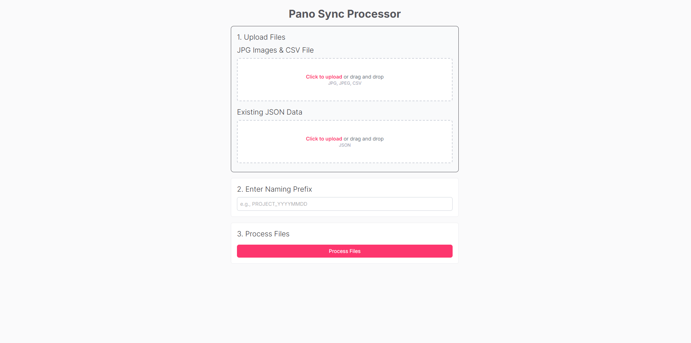

# Pano Sync Processor

A client-side web application for batch processing and renaming panoramic image sets and their corresponding metadata files.



## Overview

This tool is designed to streamline the workflow for preparing panoramic image assets. It allows a user to upload a batch of JPG images, a semicolon-delimited CSV file with correction data, and an existing master JSON file. The application then renames the images based on a user-provided prefix, converts the CSV data into a JSON format, and merges it into the master JSON file. The final processed assets—a ZIP archive of the renamed images and the updated JSON file—are then made available for download.

## Features

- **Consolidated Uploading:** Drag-and-drop a folder of images and the corresponding CSV file in one simple step.
- **Manual JSON Upload:** Provides a separate drag-and-drop uploader for the master JSON data file.
- **Custom Naming Convention:** Users can define a custom prefix (e.g., `PROJECT_YYYYMMDD`) for all processed files.
- **Automated CSV to JSON Conversion:** Parses semicolon-delimited CSV data and transforms it into the required nested JSON structure.
- **Intelligent Merging:** Merges the newly converted data into the master JSON file, overwriting existing entries if necessary.
- **Batch Downloading:** Packages all renamed images into a single `.zip` file for convenient download.
- **Modal Results:** Presents the final download links in a clean, user-friendly modal.

## Tech Stack

- **Frontend:** [React](https://react.dev/) (via [Vite](https://vitejs.dev/))
- **Styling:** [Tailwind CSS](https://tailwindcss.com/)
- **CSV Parsing:** [Papaparse](https://www.papaparse.com/)
- **File Zipping:** [JSZip](https://stuk.github.io/jszip/)

## Usage

Using the application is a simple three-step process:

1.  **Upload Files:**
    * In the first box, drag and drop (or click to select) all of your `.jpg` image files and the single `.csv` correction file.
    * In the second box, upload the existing master `.json` data file.
    * Confirmation text will appear below each box to confirm that your files have been loaded.
2.  **Enter Naming Prefix:**
    * In the text field, enter the desired prefix for your project (e.g., `PROJECT_20250819`). The application will automatically handle adding the trailing underscore.
3.  **Process and Download:**
    * Click the "Process Files" button.
    * Once processing is complete, a modal will appear with download links for your zipped images and the final, merged JSON file.


## Setup and Installation

Follow these steps to get the project running on your local machine.

### 1. Clone the Repository

First, clone this repository to your local machine or download the source code.

### 2. Install Dependencies

Navigate into the project directory and install the necessary npm packages.

```bash
cd path/to/pano-sync
npm install
```

### 3. Set Up Environment Variables

This project does not require any environment variables for local operation. All processing is handled on the client side.

### 4. Run the Development Server

Start the Vite development server.

```bash
npm run dev
```

---